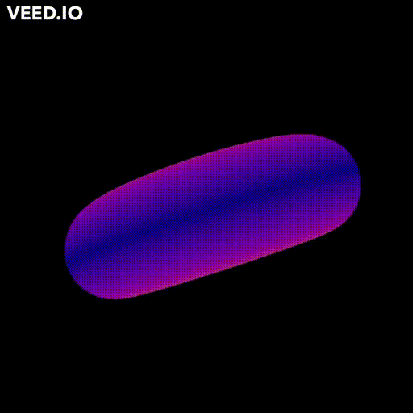
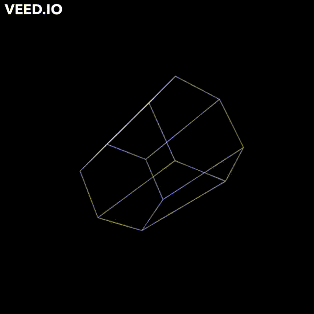
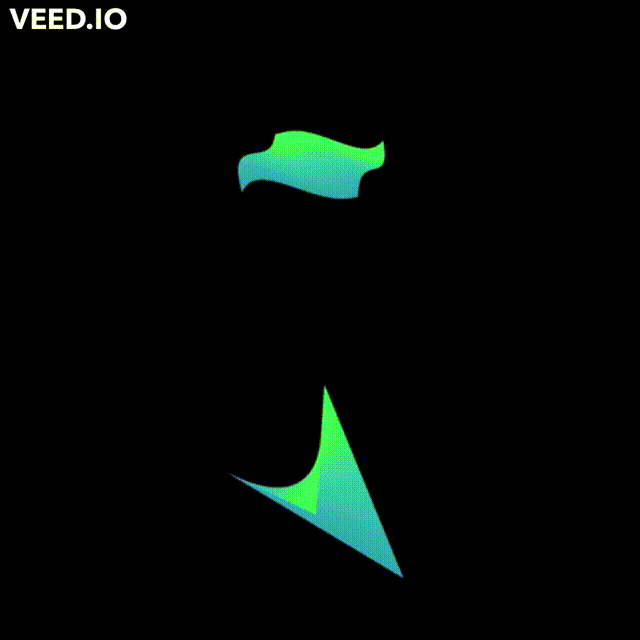

# pyOpenGL Examples

Here you will encounter a few examples exploring pyOpenGL. This repo is part of the first assigment of Computer Graphics class of CEFET-RJ.

## Torus

### Interaction
- Up arrow : Increase outter circle radius
- Down arrow : Decrease outter circle radius
- Right arrow : Increase inner circle radius
- Left arrow : Decrease inner circle radius

## Prism

### Interaction
- Up arrow : Increase number of sides
- Down arrow : Descrease number of sides

## Implicit Function

